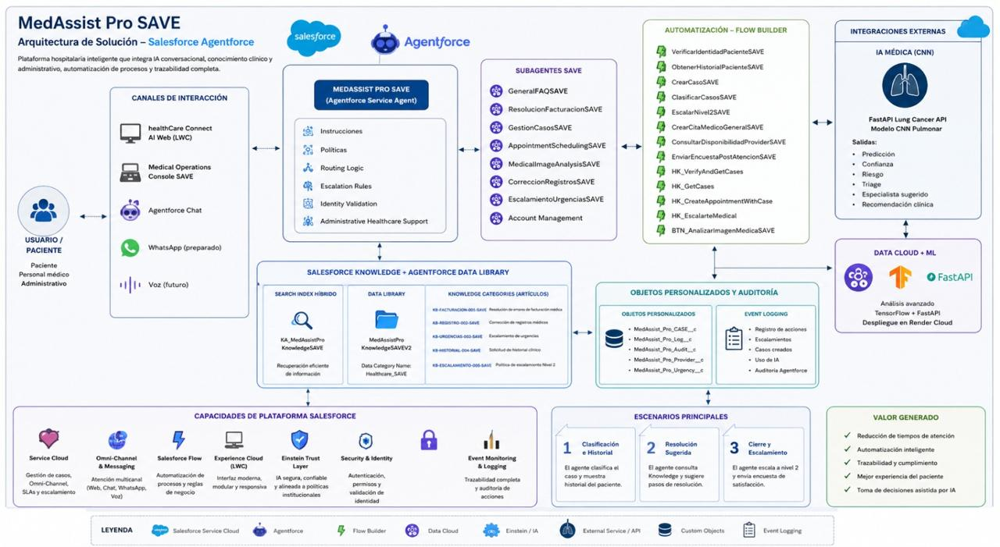

# 🏥 MedAssist Pro SAVE

> **Enterprise AI Healthcare Service Agent built with Salesforce Agentforce**



---

## 🚀 Executive Summary

MedAssist Pro SAVE is an enterprise AI healthcare service agent designed to automate administrative healthcare processes using Salesforce Agentforce.

The solution combines conversational AI, Retrieval-Augmented Generation (RAG), Salesforce Knowledge, Flow Builder, Apex automation, and external AI services to support healthcare personnel while maintaining a Human-in-the-Loop approach for critical scenarios.

Developed as part of the **HealthCare Connect AI Hackathon**, the project demonstrates how enterprise AI can improve operational efficiency, reduce response times, and enhance patient experience through intelligent automation.

---

## ✨ Key Features

- ✅ Intelligent Case Classification
- ✅ Patient Identity Verification
- ✅ Knowledge RAG
- ✅ Billing Resolution
- ✅ Medical Record Management
- ✅ Appointment Scheduling
- ✅ AI Medical Image Analysis
- ✅ Human-in-the-Loop Escalation
- ✅ Event Logging
- ✅ Satisfaction Surveys

---

## 🏗️ Solution Architecture

The platform integrates Salesforce Service Cloud, Agentforce, Knowledge RAG, Flow Builder, Apex, Data Cloud and an external AI service for medical image analysis.

The architecture follows this enterprise workflow:

```text
Patient
      │
      ▼
Agentforce Service Agent
      │
      ▼
Knowledge Retrieval (RAG)
      │
      ▼
Salesforce Knowledge
      │
      ▼
Flow Builder Automation
      │
      ▼
Salesforce Case Management
      │
      ├────────► External AI (FastAPI + CNN)
      │
      ▼
Human Escalation
      │
      ▼
Audit & Event Logging
```
